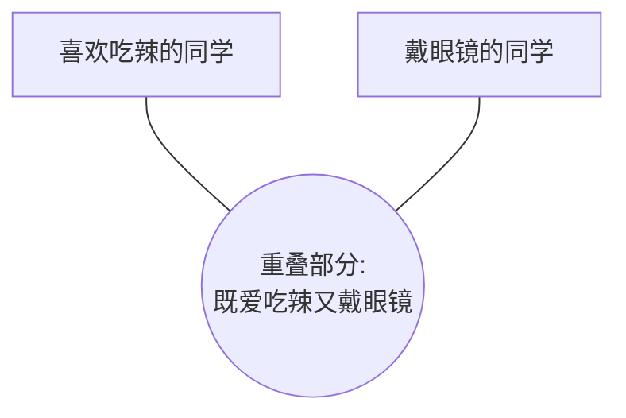

import BlurredAnswer from '@/components/ui/BlurredAnswer';
import FollowMe from '@/components/FollowMe';

# 逻辑关系 - 交叉关系

## 一、核心概念

### 1. 什么是交叉关系？

在公务员考试的判断推理模块中，“交叉关系”是一个非常重要的逻辑关系。所谓交叉关系，指的是两个概念的外延（即概念所包含的范围）存在部分重合，但又不完全重合的情况。

我们可以用一个简单的生活化例子来理解。想象一下你们班上的同学：

- **概念A：** “喜欢吃辣的同学”
- **概念B：** “戴眼镜的同学”

这两个群体之间的关系就是典型的交叉关系：
1.  **有的**喜欢吃辣的同学戴眼镜。
2.  **有的**喜欢吃辣的同学不戴眼镜。
3.  **有的**戴眼镜的同学喜欢吃辣。
4.  **有的**戴眼镜的同学不喜欢吃辣。

画成图表，就是两个有重叠部分的圆圈（韦恩图）：

所以，判断交叉关系的万能公式就是：“有的A是B，有的A不是B”。同时，反过来也成立，“有的B是A，有的B不是A”。

### 2. 易混淆概念辨析：交叉关系 vs. 并列关系

很多同学容易把交叉关系和并列关系搞混。

-   **交叉关系**：两个概念有交集，比如“老师”和“男性”。（有的老师是男性，有的不是）
-   **并列关系**：两个概念完全独立，没有交集，它们共同属于一个更大的概念（同一个“属”）。比如“苹果”和“香蕉”，它们都是“水果”，但苹果不是香蕉，香蕉也不是苹果。

易错点：判断的关键在于两个概念的定义是否存在重合的可能性。例如，“医生”和“护士”是并列关系，因为一个人的职业要么是医生，要么是护士，不可能同时是两者。而“医生”和“党员”就是交叉关系。

## 二、真题讲解

### 主题一：基础二元交叉关系

这类题目最直接，就是考察两个词语之间是否存在交叉关系。

**例1**：(2021 山东) 水生动物：卵生动物

- A. 腔肠动物：软体动物
- B. 甲壳纲动物：节肢动物
- C. 飞行动物：哺乳动物
- D. 脊椎动物：无脊椎动物

<BlurredAnswer>
**【解题思路】**

**第一步：判断题干词语间的逻辑关系。**
我们来套用公式：
- 有的水生动物是卵生动物（例如：大部分鱼类）。
- 有的水生动物不是卵生动物（例如：鲸鱼，是胎生）。
- 有的卵生动物是水生动物（例如：青蛙）。
- 有的卵生动物不是水生动物（例如：鸡、鸭）。
因此，题干的两个词是典型的交叉关系。

**第二步：依次判断选项词语间的逻辑关系。**
- **A项：** 腔肠动物和软体动物都属于无脊椎动物，是两种不同的动物门类，二者是并列关系。排除。
- **B项：** 甲壳纲动物是节肢动物门下的一个纲，例如虾、蟹。所有甲壳纲动物都属于节肢动物，所以是种属关系（或称包含关系）。排除。
- **C项：** 飞行动物和哺乳动物。
    - 有的飞行动物是哺乳动物（例如：蝙蝠）。
    - 有的飞行动物不是哺乳动物（例如：鸟类、昆虫）。
    - 有的哺乳动物是飞行动物（例如：蝙蝠）。
    - 有的哺乳动物不是飞行动物（例如：老虎、狮子）。
    二者构成交叉关系，与题干逻辑关系一致。
- **D项：** 脊椎动物和无脊椎动物是根据动物体内有无脊柱划分的，两者是矛盾关系（或称全异关系），属于并列关系的一种。排除。

**故正确答案为 C。**
</BlurredAnswer>

---

**例2**：(2017 四川) 花瓶：瓷器

- A. 电视机：电器
- B. 中药：植物
- C. 画作：诗篇
- D. 桌子：八仙桌

<BlurredAnswer>
**【解题思路】**

**第一步：判断题干词语间的逻辑关系。**
- 有的花瓶是瓷器材质的（瓷花瓶）。
- 有的花瓶不是瓷器材质的（例如：玻璃花瓶、塑料花瓶）。
- 有的瓷器是做成花瓶的样子的。
- 有的瓷器不是花瓶（例如：瓷碗、瓷盘）。
因此，题干是交叉关系。

**第二步：依次判断选项词语间的逻辑关系。**
- **A项：** 电视机是电器的一种，是种属关系。排除。
- **B项：** 中药和植物。
    - 有的中药是植物（例如：人参、甘草）。
    - 有的中药不是植物（例如：动物药如蝎子，矿物药如石膏）。
    - 有的植物可以入药成为中药。
    - 有的植物不能作为中药。
    二者构成交叉关系，与题干逻辑关系一致。
- **C项：** 画作和诗篇是两种并列的艺术形式，是并列关系。排除。
- **D项：** 八仙桌是桌子的一种，是种属关系。排除。

**故正确答案为 B。**
</BlurredAnswer>

### 主题二：交叉关系与特定属性/人物

这类题目通常是三个词，前两个词是交叉关系，第三个词是同时具备前两个词属性的特定实例。

**例3**：(2024 四川) 政治家：军事家：曹操

- A. 固体：食品：苹果
- B. 直辖市：港口城市：北京
- C. 企业家：科学家：爱因斯坦
- D. 发展中国家：亚洲国家：菲律宾

<BlurredAnswer>
**【解题思路】**

**第一步：判断题干词语间的逻辑关系。**
- **前两个词：** 有的政治家是军事家，有的不是；有的军事家是政治家，有的不是。所以“政治家”和“军事家”是交叉关系。
- **第三个词与前两个词的关系：** 曹操既是杰出的政治家，也是杰出的军事家。所以，第三个词是同时属于前两个概念的一个具体实例（特指）。

**第二步：依次判断选项，寻找与题干逻辑完全一致的选项。**
- **A项：** “固体”和“食品”是交叉关系（有的食品是固体，有的不是）。但“苹果”是“固体”和“食品”的一个种类（种属），而不是一个特定的个体（特指）。逻辑关系不完全一致，排除。
- **B项：** “直辖市”和“港口城市”是交叉关系（例如天津、上海）。“北京”是直辖市，但不是港口城市。第三个词与前两个词的关系不符，排除。
- **C项：** “企业家”和“科学家”是交叉关系。“爱因斯坦”是科学家，但通常不认为他是企业家。关系不符，排除。
- **D项：** “发展中国家”和“亚洲国家”是交叉关系（有的亚洲国家是发展中国家，有的不是，如日本）。“菲律宾”既是发展中国家，也是亚洲国家。逻辑关系与题干完全一致。

**故正确答案为 D。**
</BlurredAnswer>

---

### 主题三：多元交叉关系

这类题目会给出三个或以上的词语，它们之间两两都可能构成交叉关系，需要从多个维度进行判断。

**例4**：(2025年江苏省公务员录用考试《行测》题（A类）（网友回忆版）) 本土药材：野生药材：名贵药材

- A. 沿海高铁：跨省高铁：城际高铁
- B. 牛奶产业：传统产业：养殖产业
- C. 超限车辆：超载车辆：超重车辆
- D. 社区治理：社会治理：水土治理

<BlurredAnswer>
**【解题思路】**

**第一步：判断题干词语间的逻辑关系。**
题干中的三个词是从不同维度对“药材”进行分类的：
- **本土药材**：从产地区分。
- **野生药材**：从生长方式区分（与“人工种植”相对）。
- **名贵药材**：从价值区分。
这三个概念之间两两互为交叉关系。例如：
- 有的本土药材是野生的（如长白山野生人参），有的是人工种植的。
- 有的野生药材是名贵的（如冬虫夏草），有的则很普通。
- 有的本土药材是名贵的，有的不是。

**第二步：依次判断选项，寻找与题干逻辑完全一致的选项。**
- **A项：** 沿海高铁、跨省高铁、城际高铁，这是从不同维度对“高铁”进行分类：
  - **沿海高铁**：按地理位置划分。
  - **跨省高铁**：按行政区域范围划分。
  - **城际高铁**：按功能划分。
  三者之间同样是两两交叉关系。例如，一条高铁可以是沿海的、跨省的，同时也是城际高铁（如部分福厦高铁）。逻辑关系与题干一致。
- **B项：** “牛奶产业”是“传统产业”的一种，也是“养殖产业”的一种，它们之间是种属关系和交叉关系混合，而非两两交叉。排除。
- **C项：** “超限”、“超载”、“超重”是交通违规的三种不同类型，它们之间是并列关系。排除。
- **D项：** “社区治理”是“社会治理”的组成部分，是种属关系。“水土治理”与前两者是不同领域的治理，是并列关系。逻辑关系不符。排除。

**故正确答案为 A。**
</BlurredAnswer>

---

**例5**：(2024江苏) 实践成果：阶段成果：理论成果

- A. 经济创新：文化创新：政治创新
- B. 阅读辅导：读写辅导：写作辅导
- C. 环岛旅行：红色旅行：太空旅行
- D. 物质文明：现代文明：精神文明

<BlurredAnswer>
**【解题思路】**

**第一步：判断题干词语间的逻辑关系。**
本题考察的是一种复合逻辑关系：
-   首先，“实践成果”和“理论成果”是根据成果获取途径划分的两种不同类型，两者之间是矛盾关系（非此即彼），共同构成“成果”的全集。
-   其次，“阶段成果”是从时间维度对成果的划分，它与前两者分别构成交叉关系。
    -   有的阶段成果是实践成果，有的不是。
    -   有的阶段成果是理论成果，有的不是。
    -   有的实践成果是阶段性成果，有的则是最终成果。

**第二步：依次判断选项，寻找与题干逻辑完全一致的选项。**
- **A项：** 经济创新、文化创新、政治创新，是根据创新领域划分的三种不同类型，它们之间是并列关系。排除。
- **B项：** “读写辅导”包含了“阅读辅导”和“写作辅导”，是组成关系。排除。
- **C项：** 环岛旅行、红色旅行、太空旅行，是根据旅行主题/目的地划分的三种不同类型，它们之间是并列关系。排除。
- **D项：** 逻辑关系与题干完全一致：
    -   “物质文明”和“精神文明”是构成人类文明的两个方面，二者是矛盾关系。
    -   “现代文明”是从时间维度划分的，它与“物质文明”和“精神文明”都构成交叉关系。
        -   有的现代文明是物质文明（如高铁、网络），有的是精神文明（如新的艺术形式、价值观念）。
        -   有的物质文明属于现代文明，有的则属于古代文明。

**故正确答案为 D。**
</BlurredAnswer>

## 三、技巧总结

1.  **牢记判定公式**：判断交叉关系的核心方法就是“有的A是B，有的A不是B”。在考场上快速套用这个句式，可以迅速甄别。

2.  **区分交叉与并列**：这是最关键的一步。问自己一个问题：“这两个概念的定义有没有重叠的可能？” 如果有，就是交叉；如果完全互斥，就是并列。

3.  **注意二级辨析**：当多个选项都是交叉关系时，要进行“二级辨析”。可能需要考虑词性（名词、动词）、属性（物理属性、社会属性）、材料组成关系等更深层次的联系。

4.  **三元关系要看全**：对于三个词的题目，不仅要分析前两个词的关系，更要精确判断第三个词与前两个词分别构成的关系，确保逻辑链条的完整性和一致性。是“特指”还是“种属”，必须分清。

<FollowMe />