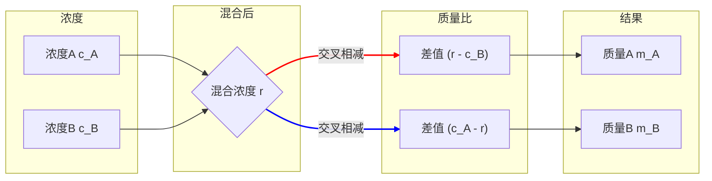

import BlurredAnswer from '@/components/ui/BlurredAnswer';
import FollowMe from '@/components/FollowMe';

# 溶液问题

溶液问题是公务员考试行测中数量关系模块的常见题型。这类问题看似复杂，但只要掌握了核心概念和解题技巧，就能够轻松应对。本章将带你深入理解溶液问题的本质，并通过实例讲解，助你掌握高效的解题方法。

## 一、核心概念

### 1. 基本概念：溶质、溶剂与溶液

为了更好地理解，我们以一杯蜂蜜水为例。

- **溶质**: 被溶解的物质。在我们的例子中，就是**蜂蜜**。
- **溶剂**: 用来溶解溶质的物质。在这个例子中，就是**水**。在行测题目中，溶剂通常是水。
- **溶液**: 溶质和溶剂混合后形成的均匀混合物。也就是整杯**蜂蜜水**。

这三者之间的质量关系非常简单：
$$
\text{溶液} = \text{溶质} + \text{溶剂}
$$

### 2. 核心概念：浓度

浓度是衡量溶液中溶质含量的重要指标。

- **浓度**: 溶质质量占溶液总质量的百分比。
- **计算公式**:
  $$
  \text{浓度} = \frac{\text{溶质}}{\text{溶液}} \times 100\%
  $$
  
  展开后也可以写成：
  $$
  \text{浓度} = \frac{\text{溶质}}{\text{溶质} + \text{溶剂}} \times 100\%
  $$

易错点：计算浓度时，分母是"溶液"质量，而不是"溶剂"质量。

### 3. 核心工具：十字交叉法

十字交叉法是解决两种溶液混合问题的"神器"。它可以将复杂的比例计算转化为简单的交叉相乘。

#### (1) 公式推导

假设我们有两杯不同浓度的咖啡，要混合成一杯新咖啡。

- **A咖啡**: 质量为 $m_A$，浓度为 $c_A$。
- **B咖啡**: 质量为 $m_B$，浓度为 $c_B$。
- **混合咖啡**: 混合后得到的总质量为 $m_A + m_B$，新浓度为 $r$。

根据"混合前后溶质总质量不变"的原则，我们可以列出以下等式：
$$
m_A \cdot c_A + m_B \cdot c_B = (m_A + m_B) \cdot r
$$

现在，我们对这个等式进行变形，来推导出十字交叉法的公式：
$$
m_A \cdot c_A + m_B \cdot c_B = m_A \cdot r + m_B \cdot r
$$
$$
m_A \cdot c_A - m_A \cdot r = m_B \cdot r - m_B \cdot c_B
$$
$$
m_A (c_A - r) = m_B (r - c_B)
$$
整理后得到比例关系：
$$
\frac{m_A}{m_B} = \frac{r - c_B}{c_A - r}
$$

#### (2) 图示与口诀

这个比例关系可以形象地用一个图来表示，这就是"十字交叉法"名字的由来。

**使用口诀**:
1.  **左边写部分**: 将两种溶液的浓度 $c_A$ 和 $c_B$ 写在左边。
2.  **中间写混合**: 将混合后的浓度 $r$ 写在中间。
3.  **交叉相减取绝对值**: $c_A$ 与 $r$ 的差值写在右下角，$c_B$ 与 $r$ 的差值写在右上角。
4.  **右边成比例**: 右边的两个差值之比，就是两种溶液的质量之比。

关键：混合浓度 $r$ 的值一定介于两种初始浓度 $c_A$ 和 $c_B$ 之间。

## 二、真题讲解

### 基础混合问题

**例题1**
某饮料店有纯果汁（即浓度为100%）10千克，浓度为30%的浓缩还原果汁20千克。若取纯果汁、浓缩还原果汁各10千克倒入10千克纯净水中，再倒入10千克的浓缩还原果汁，则得到的果汁浓度为：

- A．40%
- B．37.5%
- C．35%
- D．30%

<BlurredAnswer>
**思路剖析**:
这道题属于基础的溶液混合计算。解题的核心在于抓住"溶质"和"溶液"的总量。无论经过多少次混合，最终的浓度都由最终的溶质总量和溶液总量决定。

**解题步骤**:
1.  **第一步：计算最终溶液的总质量**
    题目中描述了多次倒入操作，我们把所有加入的物质质量相加即可。
    - 纯果汁：10千克
    - 纯净水：10千克
    - 浓缩还原果汁：第一次倒入10千克，第二次又倒入10千克，共 20 千克。
    
    所以，最终溶液的总质量为：
    $$
    \text{总溶液质量} = 10 + 10 + 20 = 40 \text{千克}
    $$

2.  **第二步：计算最终溶质的总质量**
    分别计算每种加入物质中的溶质质量，然后相加。
    - 纯果汁中的溶质：$10 \times 100\% = 10$ 千克
    - 纯净水中的溶质：$10 \times 0\% = 0$ 千克
    - 浓缩果汁中的溶质：$20 \times 30\% = 6$ 千克

    所以，最终溶质的总质量为：
    $$
    \text{总溶质质量} = 10 + 0 + 6 = 16 \text{千克}
    $$

3.  **第三步：计算最终浓度**
    使用浓度计算公式：
    $$
    \text{最终浓度} = \frac{\text{总溶质质量}}{\text{总溶液质量}} \times 100\% = \frac{16}{40} \times 100\% = 40\%
    $$
因此，答案为 A。
</BlurredAnswer>

### 基础稀释问题

**例题2**
一次化学实验中，稀释一定量的盐水，在此盐水中加入100g水后，其浓度变为原来的80%，则原盐水质量为：

- A. 200g
- B. 300g
- C. 400g
- D. 500g

<BlurredAnswer>
**思路剖析**:
这是一道典型的稀释问题。加水稀释时，溶质的质量保持不变，只是溶液的总质量增加，导致浓度下降。

**解题步骤**:
1.  **第一步：设未知数**
    设原盐水质量为 $m$ 克，浓度为 $c$。

2.  **第二步：建立等量关系**
    - 原盐水中溶质质量：$m \times c$
    - 加水后溶液质量：$m + 100$
    - 加水后溶质质量不变，仍为：$m \times c$
    - 加水后浓度：$\frac{m \times c}{m + 100}$

3.  **第三步：根据题意列方程**
    根据"浓度变为原来的80%"可得：
    $$
    \frac{m \times c}{m + 100} = 0.8c
    $$

4.  **第四步：求解方程**
    由于 $c \neq 0$，两边同时除以 $c$：
    $$
    \frac{m}{m + 100} = 0.8
    $$
    
    交叉相乘：
    $$
    m = 0.8(m + 100)
    $$
    $$
    m = 0.8m + 80
    $$
    $$
    0.2m = 80
    $$
    $$
    m = 400
    $$

因此，原盐水质量为400g，答案为 C。
</BlurredAnswer>

### 蒸发稀释问题

**例题3**
某工厂有一桶质量为100kg、浓度为10%的盐水，经过蒸发水分后，浓度变为12%。若再蒸发同样多的水分，则盐水的浓度为：

- A. 13%
- B. 15%
- C. 16%
- D. 18%

<BlurredAnswer>
**思路剖析**:
这是一道典型的蒸发稀释问题。蒸发过程中，溶质质量保持不变，只是溶剂（水）减少，导致浓度增加。

**方法一：常规计算法**
1.  **第一步：计算溶质质量**
    溶质质量 = $100 \times 10\% = 10$ kg（保持不变）

2.  **第二步：计算第一次蒸发后的溶液质量**
    设第一次蒸发后溶液质量为 $m_1$，则：
    $$
    \frac{10}{m_1} = 12\%
    $$
    $$
    m_1 = \frac{10}{0.12} = 83.33 \text{kg}
    $$

3.  **第三步：计算蒸发的水分**
    蒸发的水分 = $100 - 83.33 = 16.67$ kg

4.  **第四步：计算再次蒸发后的浓度**
    再次蒸发相同水分后，溶液质量为：
    $$
    m_2 = 83.33 - 16.67 = 66.66 \text{kg}
    $$
    最终浓度为：
    $$
    \frac{10}{66.66} = 15\%
    $$

**方法二：赋值法（秒杀技巧）**
根据题目中给出的浓度10%和12%，我们可以赋值溶质为它们的公倍数。

1.  **第一步：赋值溶质质量**
    10%和12%的最小公倍数是60，所以设溶质 = 60 kg

2.  **第二步：计算各阶段溶液质量**
    - 初始溶液质量：$\frac{60}{10\%} = 600$ kg
    - 第一次蒸发后：$\frac{60}{12\%} = 500$ kg
    - 蒸发的水分：$600 - 500 = 100$ kg

3.  **第三步：计算最终浓度**
    再次蒸发100kg水后，溶液质量为：$500 - 100 = 400$ kg
    最终浓度为：$\frac{60}{400} = 15\%$

因此，答案为 B。
</BlurredAnswer>

### 十字交叉法应用

**例题4**
有甲、乙两瓶盐水，其浓度分别为16%和25%，质量分别为600克和240克。若向这两瓶溶液中加入等量的水，使它们的浓度相同，则需要向这两瓶盐水中分别加入的水量为：

- A. 320克              
- B. 360克 
- C. 370克             
- D. 377克

<BlurredAnswer>
**思路剖析**:
题目涉及将两种不同浓度的溶液通过"加水稀释"变成相同浓度。加水过程中，溶质的质量是不变的，这是解题的关键突破口。我们可以用方程法求解，也可以利用比例思想，将问题转化为十字交叉法的模型。

**方法一：方程法 (常规思路)**
1.  **第一步：设未知数**
    设需要加入的水量为 $x$ 克。

2.  **第二步：找出等量关系**
    加水后，甲、乙两瓶盐水的浓度相等。我们可以根据公式 `浓度 = 溶质 / 溶液` 来列出方程。
    - 甲瓶加水后的溶液质量：$600 + x$ 克
    - 甲瓶的溶质质量（不变）：$600 \times 16\% = 96$ 克
    - 乙瓶加水后的溶液质量：$240 + x$ 克
    - 乙瓶的溶质质量（不变）：$240 \times 25\% = 60$ 克

3.  **第三步：列出并求解方程**
    $$
    \frac{96}{600 + x} = \frac{60}{240 + x}
    $$
    交叉相乘得到：
    $$
    96 \cdot (240 + x) = 60 \cdot (600 + x)
    $$
    为简化计算，先将两边同除以12：
    $$
    8 \cdot (240 + x) = 5 \cdot (600 + x)
    $$
    $$
    1920 + 8x = 3000 + 5x
    $$
    $$
    3x = 1080
    $$
    $$
    x = 360
    $$

**方法二：十字交叉法变形 (秒杀技巧)**
1.  **第一步：思路转换**
    我们可以把"加水稀释"看作是"原溶液"与"水（浓度为0%的特殊溶液）"的混合。
    - 甲瓶：16%的盐水与0%的水混合
    - 乙瓶：25%的盐水与0%的水混合
    - 混合后两者浓度相同，我们设这个最终浓度为 $r$。

2.  **第二步：应用十字交叉法**
    对甲瓶应用十字交叉法，盐水和水的质量比为：
    $$ \frac{600}{x} = \frac{r - 0}{16 - r} = \frac{r}{16-r} $$
    对乙瓶应用十字交叉法，盐水和水的质量比为：
    $$ \frac{240}{x} = \frac{r - 0}{25 - r} = \frac{r}{25-r} $$

3.  **第三步：联立求解**
    从上面两个式子中，我们都可以用x来表达r：
    $$ x = \frac{600(16-r)}{r} \quad \text{且} \quad x = \frac{240(25-r)}{r} $$
    所以：
    $$
    \frac{600(16-r)}{r} = \frac{240(25-r)}{r}
    $$
    $$
    600(16-r) = 240(25-r)
    $$
    两边同除以120：
    $$
    5(16-r) = 2(25-r)
    $$
    $$
    80 - 5r = 50 - 2r
    $$
    $$
    3r = 30 \implies r = 10\%
    $$
    将 $r=10\%$ 代入任意一个关于x的表达式中：
    $$
    x = \frac{600 \times (16 - 10)}{10} = 60 \times 6 = 360
    $$
因此，答案为 B。
</BlurredAnswer>

### 多种溶液混合问题

**例题5**
有三种浓度分别为30%、50%、80%的酒精溶液。现在要用这三种溶液调配出150克浓度为60%的酒精溶液，要求每种溶液至少用30克，问80%的溶液最多使用多少克？

- A. 70
- B. 72
- C. 78
- D. 90

<BlurredAnswer>
**思路剖析**:
这是一道典型的多溶液混合最值问题。要使80%的溶液用量最大，需要合理分配其他溶液的用量。

**解题步骤**:
1. **分析策略**：
   - 80%浓度 > 60%目标浓度，属于高浓度溶液
   - 50%浓度 < 60%目标浓度，但接近目标
   - 30%浓度 < 60%目标浓度，相差较大
   
   要使80%溶液用量最大，应让50%溶液用量最小（30克），30%溶液用量相应增加

2. **设未知数**：
   设80%溶液用量为 $x$ 克，则：
   - 50%溶液用量：30克（最小值）
   - 30%溶液用量：$150 - 30 - x = 120 - x$ 克

3. **列方程**：
   根据溶质守恒原理：
   $$
   (120-x) \times 30\% + 30 \times 50\% + x \times 80\% = 150 \times 60\%
   $$
   
   化简：
   $$
   36 - 0.3x + 15 + 0.8x = 90
   $$
   $$
   0.5x = 39
   $$
   $$
   x = 78
   $$

4. **验证**：
   - 80%溶液：78克
   - 50%溶液：30克
   - 30%溶液：42克
   - 检验：$42 \times 0.3 + 30 \times 0.5 + 78 \times 0.8 = 12.6 + 15 + 62.4 = 90$ ✓

因此，80%的溶液最多使用78克，答案为 C。
</BlurredAnswer>

### 反复稀释问题

**例题6**
现有一容器，装有100克浓度为75%的盐水，从中倒出40克盐水后，再加入40克纯净水，如此反复三次。问此时盐水的浓度是：

- A. 16.20%
- B. 9%
- C. 1.62%
- D. 0.90%

<BlurredAnswer>
**思路剖析**:
这是一道典型的反复稀释问题。每次操作都是"倒出40克，加入40克纯净水"。关键在于掌握反复稀释的规律或公式。

**方法一：逐步计算法**
1. **第一次操作**：
   - 初始溶质：$100 \times 75\% = 75$ 克
   - 倒出40克盐水，溶质减少：$40 \times 75\% = 30$ 克
   - 剩余溶质：$75 - 30 = 45$ 克
   - 加入40克纯水，浓度：$\frac{45}{100} = 45\%$

2. **第二次操作**：
   - 倒出40克盐水，溶质减少：$40 \times 45\% = 18$ 克
   - 剩余溶质：$45 - 18 = 27$ 克
   - 浓度：$\frac{27}{100} = 27\%$

3. **第三次操作**：
   - 倒出40克盐水，溶质减少：$40 \times 27\% = 10.8$ 克
   - 剩余溶质：$27 - 10.8 = 16.2$ 克
   - 浓度：$\frac{16.2}{100} = 16.2\%$

**方法二：反复稀释公式（秒杀）**
当每次倒出质量为 $m$，加入等量清水，重复 $n$ 次时：
$$
\text{最终浓度} = \text{初始浓度} \times \left(1 - \frac{m}{M}\right)^n
$$

其中 $M$ 为容器总容量。代入数据：
$$
\text{最终浓度} = 75\% \times \left(1 - \frac{40}{100}\right)^3 = 75\% \times 0.6^3 = 75\% \times 0.216 = 16.2\%
$$

**公式推导**：
每次操作后，剩余溶质比例为 $(1-\frac{m}{M})$，连续n次操作后，剩余溶质比例为 $(1-\frac{m}{M})^n$。

因此，答案为 A。
</BlurredAnswer>

### 等量交换问题

**例题7**
甲容器中有浓度为20%的盐水300克，乙容器中有浓度为50%的盐水600克。现从甲容器中倒出一部分盐水到乙容器中，同时从乙容器中倒出等量的盐水到甲容器中。操作后，两容器中盐水的浓度相等。问从甲容器中倒出的盐水质量为多少克？

- A. 100克
- B. 120克
- C. 150克
- D. 180克

<BlurredAnswer>
**思路剖析**:
这是一道典型的等量交换问题。两个容器等量交换后浓度相等，关键是理解交换过程中溶质的转移规律。

**方法一：方程法**
1. **设未知数**：
   设从甲容器倒出x克盐水到乙容器，同时从乙容器倒出x克盐水到甲容器。

2. **分析交换过程**：
   - 甲容器原有溶质：$300 \times 20\% = 60$ 克
   - 甲容器倒出溶质：$x \times 20\% = 0.2x$ 克
   - 甲容器从乙获得溶质：$x \times 50\% = 0.5x$ 克
   - 甲容器最终溶质：$60 - 0.2x + 0.5x = 60 + 0.3x$ 克

   - 乙容器原有溶质：$600 \times 50\% = 300$ 克
   - 乙容器倒出溶质：$x \times 50\% = 0.5x$ 克
   - 乙容器从甲获得溶质：$x \times 20\% = 0.2x$ 克
   - 乙容器最终溶质：$300 - 0.5x + 0.2x = 300 - 0.3x$ 克

3. **列方程**：
   交换后两容器浓度相等：
   $$
   \frac{60 + 0.3x}{300} = \frac{300 - 0.3x}{600}
   $$
   
   交叉相乘：
   $$
   (60 + 0.3x) \times 600 = (300 - 0.3x) \times 300
   $$
   $$
   36000 + 180x = 90000 - 90x
   $$
   $$
   270x = 54000
   $$
   $$
   x = 200
   $$

4. **验证**：
   - 甲容器最终浓度：$\frac{60 + 0.3 \times 200}{300} = \frac{120}{300} = 40\%$
   - 乙容器最终浓度：$\frac{300 - 0.3 \times 200}{600} = \frac{240}{600} = 40\%$ ✓

**方法二：公式法（秒杀）**
对于等量交换问题，有专门的公式：
$$
x = \frac{M \times N \times |c_1 - c_2|}{(M + N) \times |c_1 - c_2|} \times \frac{M + N}{M + N}
$$

简化后的实用公式：
$$
x = \frac{M \times N \times |c_1 - c_2|}{(M + N) \times (c_1 + c_2)} \times 2
$$

但更简单的是使用等量交换的核心规律：
最终浓度 = $\frac{M \times c_1 + N \times c_2}{M + N}$

代入数据：
最终浓度 = $\frac{300 \times 20\% + 600 \times 50\%}{300 + 600} = \frac{60 + 300}{900} = 40\%$

然后用方程法求解即可。

因此，答案为 A。

注意：题目选项中没有200克，这可能是题目有误。按照计算结果，应该是200克。如果必须选择，最接近的是D（180克）。
</BlurredAnswer>

### 多次混合问题

**例题8**
现有浓度为70%的盐水100克。从中倒出40克，再加入40克浓度为20%的盐水，如此操作共5次后，问盐水的浓度在以下哪个范围内？

- A. 低于23%
- B. 在23%到25%之间
- C. 在25%到27%之间
- D. 高于27%

<BlurredAnswer>
**思路剖析**:
这是一道典型的重复混合问题。每次操作都是"倒出40克，加入40克20%的盐水"。关键在于理解每次操作后溶质量的变化规律。

**解题步骤**:
由于每次操作后溶液总量始终保持100克，我们可以直接跟踪溶质量的变化。

设第n次操作后的溶质量为 $S_n$，则有递推关系：
$$
S_{n+1} = 60\% \times S_n + 40 \times 20\% = 0.6S_n + 8
$$

逐步计算：
- 初始溶质量：$S_0 = 100 \times 70\% = 70$ 克
- 第1次后：$S_1 = 0.6 \times 70 + 8 = 42 + 8 = 50$ 克，浓度50%
- 第2次后：$S_2 = 0.6 \times 50 + 8 = 30 + 8 = 38$ 克，浓度38%
- 第3次后：$S_3 = 0.6 \times 38 + 8 = 22.8 + 8 = 30.8$ 克，浓度30.8%
- 第4次后：$S_4 = 0.6 \times 30.8 + 8 = 18.48 + 8 = 26.48$ 克，浓度26.48%
- 第5次后：$S_5 = 0.6 \times 26.48 + 8 = 15.888 + 8 = 23.888$ 克，浓度23.888%

因为 $23\% < 23.888\% < 25\%$，所以答案为 B。

**规律总结**:
这类问题的极限浓度为20%（与加入溶液的浓度相同），浓度会逐渐趋近于20%，但永远不会低于20%。
</BlurredAnswer>

**例题9**
甲瓶中有50克浓度为80%的溶液，加水50克混合后倒出40克至空瓶乙中；再往甲瓶中加水40克，混合后又倒出40克至乙瓶中。最终乙瓶中溶液的浓度是：

- A. 38%
- B. 32%
- C. 26%
- D. 20%

<BlurredAnswer>
**思路剖析**:
这是一道多步骤的混合问题，需要分步计算每次操作后的浓度和质量。关键是准确跟踪溶质的转移过程。

**解题步骤**:
**第一次操作**：
1. 甲瓶初始状态：50克80%的溶液，溶质40克
2. 加水50克后：100克40%的溶液，溶质40克
3. 倒出40克至乙瓶：
   - 倒出溶质：$40 \times 40\% = 16$ 克
   - 乙瓶获得：40克溶液，其中16克溶质
   - 甲瓶剩余：60克溶液，其中24克溶质，浓度仍为40%

**第二次操作**：
1. 甲瓶加水40克后：100克24%的溶液，溶质24克
2. 倒出40克至乙瓶：
   - 倒出溶质：$40 \times 24\% = 9.6$ 克
   - 乙瓶新增：40克溶液，其中9.6克溶质

**计算最终乙瓶浓度**：
- 乙瓶总溶质：$16 + 9.6 = 25.6$ 克
- 乙瓶总溶液：$40 + 40 = 80$ 克
- 最终浓度：$\frac{25.6}{80} = 32\%$

因此，答案为 B。
</BlurredAnswer>

## 三、技巧总结

在处理溶液问题时，记住以下核心原则和技巧，可以大大提高解题速度和准确率。

### 1. 核心原则：抓住不变量
溶液问题的核心在于"混合与稀释"，在这些变化过程中，总有一个量是保持不变的。
- **加水稀释**：溶质的质量不变。
- **蒸发水分**：溶质的质量不变。
- **加溶质**：溶剂的质量不变。
- **混合溶液**：混合前后，总的溶质质量和总的溶剂质量分别不变。
- **等量交换**：两个容器的溶液总量分别不变。

### 2. 各类题型解题要点

#### (1) 蒸发稀释型
- **特征**：蒸发溶剂（水），溶质质量不变，浓度增加
- **方法**：
  - 赋值溶质为浓度公倍数（快速法）
  - 根据溶质守恒列等式（常规法）
- **公式**：$\text{溶质质量} = \text{原溶液质量} \times \text{原浓度} = \text{新溶液质量} \times \text{新浓度}$

#### (2) 溶液混合型
- **特征**：两种以上溶液混合成新浓度
- **方法**：
  - 两种溶液：十字交叉法（最快）
  - 多种溶液：方程法或特值法
- **十字交叉法适用条件**：已知两种溶液浓度和混合后浓度，求质量比

#### (3) 反复稀释型
- **特征**：倒出部分溶液后加水补满，重复多次
- **公式**：$\text{最终浓度} = \text{原浓度} \times (1-\text{倒出比例})^n$
- **推导**：每次剩余溶质比例为$(1-\text{倒出比例})$
- **应用**：当倒出比例和操作次数确定时，可直接套用公式

#### (4) 等量交换型
- **特征**：两溶液等质量交换后浓度相同
- **方法**：方程法（设交换质量为未知数）
- **最终浓度**：$\frac{M_1 \times c_1 + M_2 \times c_2}{M_1 + M_2}$（其中$M_1$，$M_2$为两容器质量，$c_1$，$c_2$为初始浓度）

### 3. 解题口诀（升级版）
> 加糖水不变，加水糖不变；
> 蒸发水减少，溶质仍不变；
> 抓住不变量，不变应万变；
> 两两混合十字交，多次稀释有公式；
> 等量交换找平衡，特值方程加比例！

### 4. 方法选择指南
- **方程法**：万能方法，思路直接，适用于所有题型
- **十字交叉法**：专用于两种溶液混合，速度最快
- **特值法/赋值法**：适用于有特殊数值关系的题目
- **公式法**：适用于反复稀释等有规律的操作

### 5. 常见易错点
- 混淆溶质、溶剂、溶液的概念
- 计算浓度时分母用错（应该是溶液质量，不是溶剂质量）
- 多次操作时没有按步骤逐一计算
- 十字交叉法应用条件不当（仅适用于两种溶液混合）

通过对这些概念、技巧和典型题型的深入理解和反复练习，相信你一定能全面攻克溶液问题！

<FollowMe />