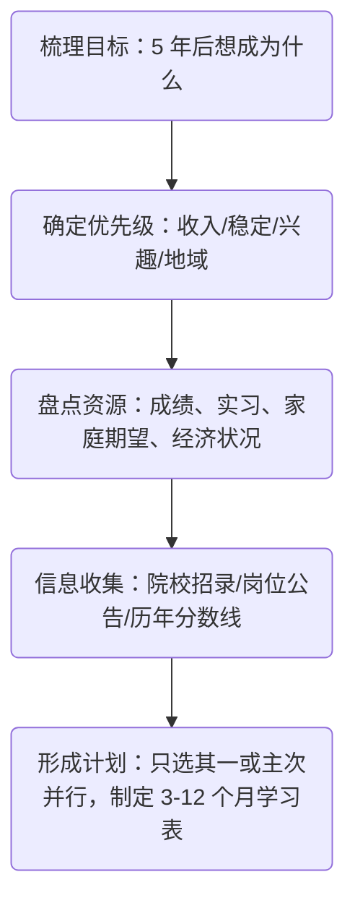

import FollowMe from '@/components/FollowMe'

**结论**

* **“考研”和“考公”没有绝对优劣**，最核心的是**职业目标、价值取向、时间成本**是否匹配。先弄清“想过怎样的生活 + 想解决什么问题”，再反推需要的学历或平台。

---

## 1. 定义与基本路径

| 项目         | 考研（学术/专业硕士为主）                      | 考公（国考/省考为主）                                   |
| ---------- | ---------------------------------- | --------------------------------------------- |
| 目标         | 获得更高学历、进入科研或高端技术岗位、为后续博士/高校/研发岗位铺路 | 进入各级党政机关或参公事业单位，获得公务员编制                       |
| 备考周期       | 通常 8–15 个月（含专业课+公共课）               | 通常 4–10 个月（行测+申论，岗位匹配后还需面试备考）                 |
| 硬性门槛       | 本科毕业/大四在读；部分名校或热门专业要求更高            | 年龄 &lt;35（少数岗位放宽），专业、户籍、政治面貌等岗位限制多               |
| 录取/录用比     | 名校热门专业 10‒20:1；双非冷门 &lt;5:1           | 热门部委岗位 &gt;200:1；冷门基层岗位 &lt;5:1                     |
| 发展通道       | 学术：读博→高校/科研院所； 专业硕：大厂/研究院/工程师/咨询等  | 科层晋升：科员→科长→处级→厅局级等                            |
| 收入预期（首年应届） | 一线城市硕士科技岗税前 20–35 万；高校助研 8–15 万    | 发达地区基层公务员到手 10–14 万 + 五险二金；北上广委办局到手 16–22 万左右 |
| 风险         | 读研期间机会成本高；科研压力或就业竞争                | 岗位地域限制大；晋升名额有限，竞争长期存在                         |

---

## 2. 关键决策维度

1. **职业目标与兴趣**

   * 想深耕技术、科研、或进大厂/外企研发 → **考研更契合**
   * 喜欢宏观治理、公共政策、稳定编制 → **考公更契合**

2. **短期 vs 长期收益**

   * 短期：公务员工资不高但“五险二金 + 编制”稳定；硕士毕业去企业首薪通常高于公务员。
   * 长期：研究/技术路线如果做到专家级，天花板远高；公务员晋升到处级后收入和社会资源也会明显提高。

3. **机会成本**

   * 考研 ≈ 再投入 2‒3 年学费和时间；考公若失败，可继续二战或转考事业单位/企业。
   * 若已找到心仪工作、家庭压力大，读研带来的迟延收入需谨慎评估。

4. **个人优势匹配**

   * 专业课基础扎实、科研兴趣浓 → 考研成功率和后续发展更高。
   * 逻辑/文字表达强、心态稳、适应机关文化 → 考公更具优势。

5. **城市与户籍因素**

   * 想落户一线/强二线城市：

     * 研究生学历落户政策宽松；
     * 公务员需考当地编制且大概率从区县基层做起。

---

## 3. 场景式建议

| 典型背景                          | 建议理由                                       |
| ----------------------------- | ------------------------------------------ |
| **工科/计算机本科，追求技术深度、想进大厂 R\&D** | **优先考研**：研究生学历几乎成标配，校招通道更好，起薪高 + 技术晋升路线清晰  |
| **文科本科，家乡三线城市，重视稳定与父母团聚**     | **优先考公**：地缘/户籍加分，职位多；硕士读完仍可能回家乡求稳          |
| **双非院校本科，暂未明确方向**             | 先用半年时间尝试行测/申论刷分；若分数竞争力强 → 考公；否则全力准备考研冲更高平台 |
| **已本科毕业工作 1‒2 年，对现岗位无兴趣**     | 若愿意脱产 & 目标行业需研究生 → 考研；若追求稳定、已有地域倾向 → 考公    |
| **科研型人格，目标高校/研究所**            | 本科期间即积极参与导师课题，直博/推免更优于二战考研                 |

---

## 4. 双路并行可行吗？

* **可行，但需主次分明**

  * 行测与政治、英语复习有部分交叉；但专业课 or 申论面试要求迥异。
  * 建议**先确定主线 70% 时间**，另一条作为保底/冲刺，避免两头不到岸。

---

## 5. 决策流程（5 步走）

---

## 6. 常见疑问速答

| 问题                 | 答案                                     |
| ------------------ | -------------------------------------- |
| **考研失败还能考公吗？**     | 可以。多数公务员岗位只看最高已取得学历，初试成绩不影响报考。         |
| **公务员编制和事业编差别大吗？** | 事业编改革后差距缩小，但公务员在晋升、政策影响力上仍占优。          |
| **读完硕士再考公是否划算？**   | 若目标部委/省直热门岗，硕士学历加分显著；基层岗硕士溢价有限。        |
| **国考/省考难度差异？**     | 国考报名人数更多，综合分更高；省考地域限制强、专业限制多，但基层门槛相对低。 |

---

### 最后的小建议

* **先做“价值排序”**：职业成就感 vs 生活稳定 vs 经济回报。
* **做两套备选计划**：主线 + 备胎，降低决策焦虑。
* **多跟过来人访谈**：了解真实工作/读研体验，避免信息偏差。
* 在任何路径上，**核心竞争力仍是持续学习能力**——学历或编制只是起点。祝你选到最适合自己的赛道！

<FollowMe />