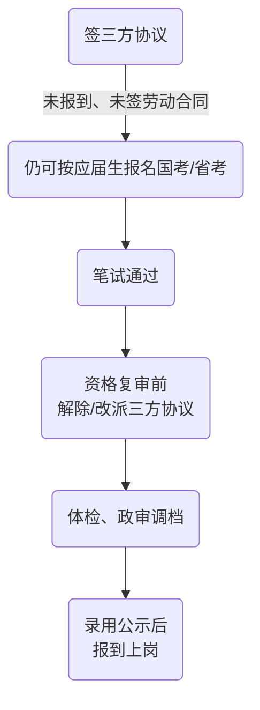

import FollowMe from '@/components/FollowMe'

**结论**

* **仅签“三方协议”≠正式就业，不会阻止你报考公务员。**
* **是否还能报“应届生专岗”** 取决于你有没有 **签劳动合同 + 缴纳职工社保 + 已办理报到证**；只要这三件事都**没**发生，一般仍按“应届生”认定。
* 真正需要注意的是后续手续：一旦你考公上岸，必须在体检或政审前**解除三方协议**，把档案、报到证等调到录用机关。

---

## 1  三方协议的法律属性

| 文件     | 本质          | 是否建立劳动关系 | 是否缴社保  | 对“应届身份”的影响          |
| ------ | ----------- | -------- | ------ | ------------------- |
| 三方就业协议 | 就业意向 + 档案去向 | ✖        | ✖      | **无直接影响**           |
| 劳动合同   | 正式劳动关系      | ✔        | 必缴职工社保 | **失去“应届生”资格**（多数地区） |

> 教育部等部门明确：三方协议只是用来“锁定”录用意向和档案流向，并不等同劳动合同，单独签署或毁约都不会改变学生身份。

---

## 2  国考 / 省考对“应届生”身份的判定

| 情形                                          | 2025 年国考通行口径\* |
| ------------------------------------------- | -------------- |
| **毕业当年**，无论是否签三方                            | 视为“应届高校毕业生”    |
| **毕业 ≤2 年**（多数省延长至 3 年），未签劳动合同 **且** 未缴职工社保 | 仍属“择业期内应届生”    |
| 已签劳动合同 **或** 已缴职工社保 **或** 档案随报到证落户单位        | 通常被视为“社会人员”    |

\* 各省可作细化；近两年已有省份宣布**不再以社保记录为硬门槛**，最好电话向招录单位核实。

---

## 3  三方协议常见疑问

| 问题                  | 答案                                                             |
| ------------------- | -------------------------------------------------------------- |
| **签了三方就要缴社保吗？**     | 不一定。只有在你到单位报到并签劳动合同后，单位才会为你缴纳职工社保。                             |
| **缴了居民社保算“就业”吗？**   | 一般不算。认定就业主要看是否缴纳**职工社保**；居民医保/居民社保通常不影响应届身份。     |
| **已签三方还能毁约考公吗？**    | 可以，但需按照协议约定承担违约金或补办解约函，并让学校重新开具《改派证明》或新版报到证。                   |
| **考公面试/政审时需要什么材料？** | 招录单位通常要求：①原三方协议或解约证明；②学校或人才中心出具的《学生档案及派遣去向证明》；③未缴纳职工社保证明（必要时）。 |

---

## 4  报考&后续操作时间线

* **关键节点 D：** 招录单位会检查你的档案去向，若仍锁在原签约单位，须先解约改派。
* 若三方协议已生效并报到：需与单位、人社局沟通“离职 + 退档”，程序更繁琐，务必预留时间。

---

## 5  实用建议

1. **尚未确定就业且有考公意向**

   * 可以先签留一个“保底”岗位，但暂缓报到、暂不交社保。
   * 关注违约金条款，确保可承受再签。

2. **已签三方且决定主攻考公**

   * 与 HR 沟通解约意向，了解违约金金额和解约流程。
   * 务必在资格复审/政审前办妥“解约 + 改派”，避免因档案问题被取消资格。

3. **已缴社保但仅想冲“社会人员岗”**

   * 直接以社会人员身份报考即可，三方协议和社保记录不会影响大多数不限应届的职位。

---

### 一句话总结

> **三方协议本身不影响你报考任何公务员岗位；真正要警惕的是**“签劳动合同 + 缴职工社保 + 报到证落户”\*\*这三步，一旦完成就很难再走‘应届通道’。\*\*提前规划好解约或改派时间点，就不会让三方协议成为你考公路上的“绊脚石”。 

<FollowMe />